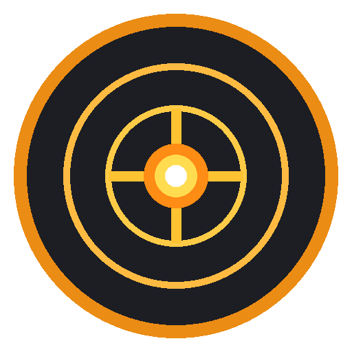

# 💥 ShotgunKeys for Windows

<div align="center">



**Transform every keystroke into an explosive shotgun blast with real-time pump reloads.**  
*High-performance, ultra-low-latency tactical typing sound engine for Windows 10 & 11.*

[](https://github.com/)
[](https://www.python.org/)
[](https://pygame.org/)
[](LICENSE)

[English](#english) | [中文说明](#chinese)

</div>

---

<a name="english"></a>
## 🌟 Key Features

- **⚡ Zero-Lag Low-Level Interceptor**: Native Windows `WH_KEYBOARD_LL` hook capturing keypresses with sub-millisecond latency across all full-screen games, code editors, and browsers.
- **🔊 32-Voice Polyphonic Audio Engine**: Pre-buffered 512-sample mixer allowing hyper-speed typing (150+ WPM) without audio clipping or choking.
- **🎲 Anti-Robotic Dynamic Micro-Randomization**: Real-time pitch (+/- 4%) and volume micro-variations so rapid typing sounds organic and alive.
- **🔄 Smart Reload Mechanics**: Dedicated pump-action reload sound triggered on **Spacebar** and **Enter** keys (customizable).
- **🎛️ 7 Built-In Sound Profiles**: Switch between authentic 12-gauge firearms, sci-fi plasma rifles, retro arcade blasters, and covert suppressed guns.
- **📁 Custom Sound Packs**: Drop your own `.wav`, `.mp3`, `.ogg`, or `.flac` audio files into `custom_sounds/`.
- **🖥️ Sleek Tactical Dark GUI**: Live firing statistics counters, master volume slider, preset selector, and audio preview test triggers.
- **🛡️ System Tray Integration**: Runs silently in the background with convenient tray quick-access menu and hot-switching.

---

## 🎛️ Sound Presets

| Profile | Icon | Sound Character | Included Samples |
| :--- | :---: | :--- | :--- |
| **Realistic 12-Gauge** | 💥 | Authentic live-recorded field blasts with heavy mechanical pump | 4 Blasts + 3 Reloads |
| **Tactical Combat** | 🎯 | Crisp & snappy military combat shotgun with breach rack | 3 Blasts + 2 Reloads |
| **Heavy Doom** | ⚡ | Massive sub-bass double-barrel super shotgun thunder | 2 Heavy Blasts + 2 Reloads |
| **Silenced Spec-Ops** | 🤫 | Covert suppressed puff and lubricated smooth slide | 2 Suppressed + 2 Reloads |
| **Cyberpunk Energy** | 🔮 | High-energy futuristic plasma discharge with servo cycle | 2 Plasma + 2 Reloads |
| **8-Bit Retro Arcade** | 🕹️ | Punchy 8-bit retro arcade synth blast and chiptune power-reload | 1 Synth Blast + 1 Chiptune |
| **Custom (User Folder)** | 📁 | Plays your custom audio files dropped into `custom_sounds/` | Infinite User Sounds |

---

## 🚀 Quick Start

### Method 1: One-Click Run (Source)
1. Ensure [Python 3.9+](https://www.python.org/downloads/) is installed (check **"Add Python to PATH"** during setup).
2. Double-click **`run.bat`**.
   - It will automatically install any missing dependencies and start the app in background tray mode.

### Method 2: Command Line
```powershell
# 1. Clone or download repository
cd ShotgunKeys-Windows

# 2. Install dependencies
pip install -r requirements.txt

# 3. Launch ShotgunKeys
python main.py
```

### Optional Command-Line Arguments
- `python main.py --minimized` : Launch directly into the system tray without opening the window.
- `python main.py --mute` : Launch in muted state.

---

## 🔨 Packaging Standalone `.exe` (PyInstaller)

You can package ShotgunKeys into a single, zero-dependency standalone `ShotgunKeys.exe` containing all sounds and icons:

1. Double-click **`build_exe.bat`** (or run `python build_exe.py`).
2. Once complete, your standalone executable will be in:
   ```
   dist/
   ├── ShotgunKeys.exe
   └── custom_sounds/
       └── README.txt
   ```
3. You can move `ShotgunKeys.exe` anywhere!

---

## 📁 Adding Custom Sounds

1. Open the `custom_sounds/` folder (or click **📁 Custom Sounds** in the app).
2. Drop any `.wav`, `.mp3`, `.ogg`, or `.flac` audio files:
   - **For Key Blasts**: Include `blast`, `shot`, `fire`, or `gun` in the filename (e.g. `laser_blast1.wav`).
   - **For Reloads**: Include `reload`, `pump`, `cock`, or `rack` in the filename (e.g. `shotgun_pump.wav`).
3. Select **Custom (User Folder)** from the preset dropdown, or click **🔄 Refresh Sounds**.

---

## 🛠️ Troubleshooting & FAQ

### 1. Antivirus / Windows Defender False Positive
Because ShotgunKeys uses low-level keyboard hooks (`WH_KEYBOARD_LL`) to detect keystrokes globally in games and background apps, some heuristics flag it as a keylogger.
- **Solution**: ShotgunKeys is 100% open-source and offline — it never records, transmits, or logs keystrokes. Add `ShotgunKeys.exe` to your Windows Defender / Antivirus exclusions.

### 2. Audio Latency or Crackling
ShotgunKeys defaults to a low-latency 512-sample audio buffer. If your audio interface experiences crackles:
- Check that your default Windows audio sample rate is set to **44,100 Hz** or **48,000 Hz** (Windows Sound Settings -> Properties -> Advanced).

### 3. Keystrokes Not Registering in Admin/Elevated Games
If you are playing games running with Administrator privileges (like *Valorant*, *CS2*, *Apex Legends*):
- Right-click `ShotgunKeys.exe` (or your command prompt) and select **"Run as Administrator"** so the global hook can receive input across elevated windows.

---

<a name="chinese"></a>
## 🇨🇳 中文说明 (Chinese Guide)

### 🌟 核心特性
- **⚡ 超低延迟键盘拦截**：基于 Windows 原生底层钩子 (`WH_KEYBOARD_LL`)，在各类全屏游戏、IDE和浏览器中实现毫秒级即时响应。
- **🔊 32 声道多音轨引擎**：512 采样低延迟预加载，支持 150+ WPM 极速打字不吞音。
- **🎲 防机械感微音调算法**：动态随机微调音调 (+/- 4%) 与音量，杜绝单调机械感。
- **🔄 空格与回车上膛机制**：敲击普通按键开火，敲击 **空格键** 或 **回车键** 自动触发霰弹枪上膛音效。
- **🎛️ 7 套内置音效预设**：真实 12 号口径、战术突击、毁灭战士双管猎枪、特种微声、赛博朋克等离子、8-Bit 复古街机与自定义文件夹。
- **📁 自定义音效包**：将任意 `.wav` / `.mp3` 放入 `custom_sounds/` 文件夹即可载入。
- **🖥️ 战术深色界面与系统托盘**：实时击发计数、主音量调节、音效试听与一键托盘后台运行。

### 🚀 快速启动
1. 双击运行 **`run.bat`** 即可自动安装依赖并启动程序。
2. 双击运行 **`build_exe.bat`** 可一键打包生成独立的 `dist/ShotgunKeys.exe` 绿色单文件版。

---

## 📄 License

Distributed under the [MIT License](LICENSE). Free for personal, gaming, and commercial use.
